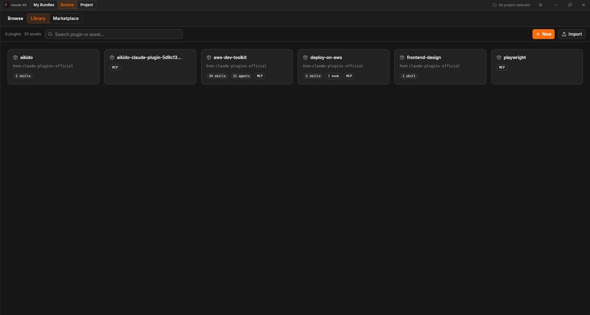
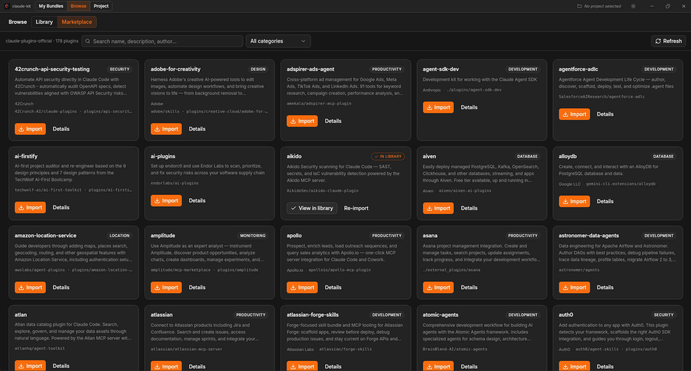

<div align="center">
  
  <h1>claude-kit</h1>
  <p><strong>Manage your Claude Code assets as reusable bundles — and apply them to any project in one click.</strong></p>
  <p>
    
    
    
  </p>
</div>

---

claude-kit is a desktop app for developers who use [Claude Code](https://claude.ai/code). It gives you a central library of skills, commands, agents, hooks and MCP server configs — organized as plugins, grouped into bundles, and applied to projects via symlinks in `.claude/`.

Import from the official [claude-plugins-official](https://github.com/anthropics/claude-plugins-official) marketplace, from any local plugin folder, or create your own assets from scratch.

## Screenshots

<table>
  <tr>
    <td></td>
    <td></td>
  </tr>
  <tr>
    <td align="center"><sub>Browse Library — imported plugins with asset counts</sub></td>
    <td align="center"><sub>Browse Marketplace — 100+ official plugins</sub></td>
  </tr>
  <tr>
    <td></td>
    <td></td>
  </tr>
  <tr>
    <td align="center"><sub>Bundle editor — pick assets from your library</sub></td>
    <td align="center"><sub>Asset editor — CodeMirror 6 with Markdown highlighting</sub></td>
  </tr>
</table>

## How it works

1. **Import** plugins from the marketplace or a local folder — skills, commands, agents, hooks and MCP configs land in `~/.claude-assets/library/`
2. **Bundle** the assets you want together (`python-backend`, `web-frontend`, …)
3. **Apply** a bundle to a project — claude-kit creates relative symlinks in `<project>/.claude/`
4. Switch project, apply another bundle — each project keeps its own set of assets

```
~/.claude-assets/
├── library/
│   ├── skills/          # each is a directory with SKILL.md
│   ├── commands/        # flat .md files
│   ├── agents/          # flat .md files
│   ├── hooks/           # <plugin>/<script> — hook files
│   ├── mcp/             # <plugin>.json — MCP server configs
│   └── .origins.json    # provenance (plugin, version, imported_at)
└── bundles/
    └── python-backend.json
```

Symlinks are **relative** — they survive if you move the project or the library.

## Features

**Library & plugins**
- Plugin grid with asset counts (skills, commands, agents, hooks, MCP)
- Search by plugin name or asset name/description/tag
- Import from the official marketplace or any local folder
- Automatic update detection: badge shows when a newer version is available
- View hook file contents inline, browse MCP server configs as JSON
- Docs button: opens the plugin README fetched from GitHub
- Remove any plugin in one click (with symlink safety warning)

**Bundles**
- Create named bundles and pick assets from your library
- Apply *additively* (add on top) or with *replace* (clean then apply)
- Each bundle tracks which assets it owns in the project view

**Project view**
- Dashboard showing active bundles, standalone assets, and installed hooks
- Clean all: removes every symlink claude-kit created, leaves hand-written files untouched

**Marketplace**
- Browses `claude-plugins-official` — 100+ community plugins
- Per-plugin status: In Library / Update available / Not imported
- Works for plugins that only ship MCP configs (like Playwright)

**MCP support**
- Import `.mcp.json` from any plugin
- Merge MCP server configs into `<project>/.claude/mcp.json` without overwriting existing keys

**Asset editor**
- CodeMirror 6 with Markdown syntax highlighting
- Edit / Preview toggle, `Ctrl+S` to save

**UI**
- Dark / light theme (persisted, no flash on load)
- Custom slim window chrome, native traffic lights on macOS
- Runs on Linux (including WSLg), macOS, and Windows

## Prerequisites

- **Node 20+** and **Rust stable** ([rustup](https://rustup.rs/))
- **Linux:** system dependencies required by Tauri:
  ```bash
  sudo apt install libwebkit2gtk-4.1-dev libgtk-3-dev libayatana-appindicator3-dev librsvg2-dev
  ```
  On Ubuntu 24.04, use `libasound2t64` instead of `libasound2`.
- **macOS / Windows:** no extra dependencies

## Getting started

```bash
git clone https://github.com/Warshoow/claude-kit
cd claude-kit
npm install
npm run tauri dev
```

The app creates `~/.claude-assets/` on first launch. Override with `CLAUDE_KIT_HOME` (useful for testing):

```bash
CLAUDE_KIT_HOME=/tmp/kit-test npm run tauri dev
```

## Building for distribution

```bash
npm run tauri build   # → src-tauri/target/release/bundle/
```

> **Note:** Tauri does not cross-compile. Build on the target OS (Linux for `.deb`/`.AppImage`, macOS for `.dmg`, Windows for `.msi`/`.exe`).

Pre-built binaries are available on the [Releases](../../releases) page.

See [`docs/build.md`](docs/build.md) for the full procedure including icon generation and WSL-specific notes.

## Roadmap

See [`docs/roadmap.md`](docs/roadmap.md) — highlights:

- **AI integration** — bundle recommender & asset generator (via Claude Code CLI subprocess or any OpenAI-compatible API/local model)
- **Multiple marketplace sources** — add community or private marketplaces alongside the official one
- **CLI tool `ck`** — `ck apply <bundle>` from a project terminal

## Tech stack

| Layer | Tech |
|-------|------|
| Shell | [Tauri 2](https://tauri.app) (Rust) |
| Frontend | [Vue 3](https://vuejs.org) + [Pinia](https://pinia.vuejs.org) |
| Styling | [Tailwind v4](https://tailwindcss.com) + [shadcn-vue](https://www.shadcn-vue.com) |
| Editor | [CodeMirror 6](https://codemirror.net) |
| Icons | [Lucide](https://lucide.dev) |

## License

MIT
